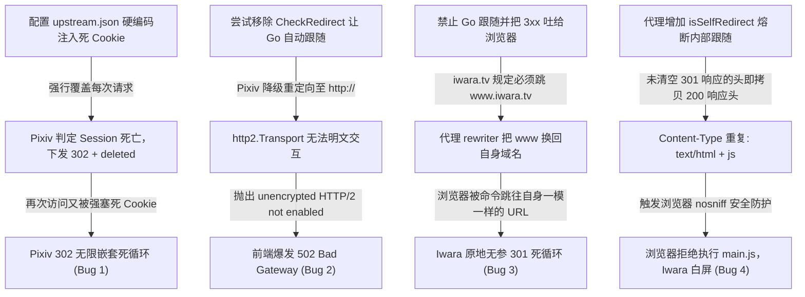

# ECH-Proxy v1.1.4 连环重定向与 Cookie 异常事故复盘深度报告

本报告针对从 **v1.1.3 升级到 v1.1.4 过程中** 出现的以下 4 个严重连环故障进行技术级根因剖析、事故时序复现与最终闭环解决方案说明：

1. **Pixiv 陷入无限 302 嵌套重定向（`?return_to=%2F%3Freturn_to%3D%252F...`）且无法登录**
2. **解除重定向跟随后的 HTTP/2 客户端 502 Bad Gateway 报错**
3. **Iwara 陷入“毫无参数（连 param 都没有）”的原地 301 自我重定向死循环（`ERR_TOO_MANY_REDIRECTS`）**
4. **熔断自我重定向后 Iwara 前端核心 JS 被浏览器拦截拒绝执行导致整站白屏**

---

## 一、 问题全景图与连环因果链



---

## 二、 深度技术根因剖析

### 故障 1：Pixiv 为什么会无限嵌套 `?return_to=%2F...` 且无法登录？

#### 1. 发生改动
在 commit `762fca7` 中，为了所谓“开箱即用免登录浏览”，在 `certs/l.moonchan.xyz/upstream.json` 的 `pixiv.l.moonchan.xyz` 节点下硬编码配置了作者浏览器抓包提取的整串 Cookie，其中包含过期的 `PHPSESSID=69100606_...` 和 `cf_clearance`。同时编写了 `seedFixedCookiesToBrowser()` 逻辑试图把这些 Cookie 播种给浏览器。

#### 2. 根因剖析
在 [`echproxy/cookie.go`](file:///home/luminovoez/ech-proxy/echproxy/cookie.go) 的 `applyCookies()` 函数中，合并策略如下：
```go
// Merge fixed/local file cookies specified in config (highest priority, overrides previous same-named items)
if fixedCookie != "" { ... }
```
**配置中的固定 Cookie 拥有绝对最高优先级，会无条件覆盖请求中的同名凭证！**

* **请求时序**：
  1. 浏览器访问 `https://pixiv.l.moonchan.xyz/`。
  2. 代理向 upstream 发起请求，`applyCookies` 把配置里**已经过期的 `PHPSESSID`** 强塞进请求头。
  3. Pixiv 源站鉴权组件检测到此 Session ID 已过期，判定非法会话：
     ```http
     HTTP/2 302 Found
     Location: http://www.pixiv.net/?return_to=%2F
     Set-Cookie: PHPSESSID=deleted; expires=Thu, 01 Jan 1970 00:00:01 GMT; Max-Age=0; ...
     ```
  4. 浏览器收到 302 后跟随跳转，向代理请求 `/?return_to=%2F`。
  5. **致命点**：代理发往 Pixiv 时，再次无条件注入了配置里的死 `PHPSESSID`！
  6. Pixiv 再次判定 Session 死亡，在现有路径上又套一层重定向：
     ```http
     Location: http://www.pixiv.net/?return_to=%2F%3Freturn_to%3D%252F
     ```
  7. 每次跳一步就叠加一层 `return_to`，形成阶梯式无限套娃死循环。
  8. 用户如果试图点击登录，Pixiv 下发新 Token，下一秒又被代理塞入的旧死 Cookie 覆盖，导致登录永远失败。

---

### 故障 2：为什么移除跟随重定向会导致 HTTP/2 爆发 502？

#### 1. 机制背景
在 [`echproxy/ech/client.go`](file:///home/luminovoez/ech-proxy/echproxy/ech/client.go) 中，为了规避 Cloudflare WAF 对 Go 官方指纹的识别，使用了 `utls` 模拟 Chrome 120 的 TLS ClientHello 指纹，并搭配了 `golang.org/x/net/http2.Transport`：
```go
func newTransport(echConfig []byte, ipMode string) *http2.Transport {
    return &http2.Transport{
        AllowHTTP: false, // 严格禁止明文 HTTP
        ...
    }
}
```

#### 2. 根因剖析
当 Pixiv 返回 302 重定向时，注意其给出的 Location 是：
`Location: http://www.pixiv.net/?return_to=%2F`（**注意是明文 `http://`，不是 `https://`**）。

如果 Go 的 `http.Client` 没有拦截重定向（即没有配置 `CheckRedirect: http.ErrUseLastResponse`）：
1. Go 标准库会自动尝试跟随这个 `http://` 开头的目标。
2. 由于底层的 `Transport` 挂载的是 `http2.Transport`（只懂得在 TLS 协商后的 h2 通道里发帧，且 `AllowHTTP: false`）。
3. Go 内部尝试在明文 TCP 端口上直接协商 HTTP/2，触发传输层断言失败：
   ```text
   upstream: Get "http://www.pixiv.net/?return_to=%2F": http2: unencrypted HTTP/2 not enabled
   ```
4. 代理层捕获到底层错误，向客户端抛出 `502 Bad Gateway`。

---

### 故障 3：为什么会出现“毫无参数（连 param 都没有）”的原地 301 重定向？

#### 1. 现象复现
在控制台执行请求时：
```bash
curl -I -H "Host: iwara.l.moonchan.xyz:8443" http://127.0.0.1:8443/
```
收到的响应令人抓狂：
```http
HTTP/1.1 301 Moved Permanently
Location: https://iwara.l.moonchan.xyz:8443/
```
**目标 URL 与当前请求的 URL 完完全全一模一样！没有任何 Query 参数！**

#### 2. 根因剖析
这个死循环是由 **上游服务器规范化跳转 + 代理 URL 域重写** 碰撞产生的：

1. 在 `upstream.json` 中，Iwara 配置的 Host 为 apex 裸域：
   ```json
   "iwara.l.moonchan.xyz": {
       "host": "iwara.tv",
       "rewrites": {
           "www.iwara.tv": "iwara.l.moonchan.xyz"
       }
   }
   ```
2. 真实的 Iwara 服务器（Cloudflare + Nginx）做了强制 Canonical 规范化：所有访问裸域 `iwara.tv` 的流量，**必须 301 永久重定向到 `www.iwara.tv`**。
3. 当代理向上游发送 `GET https://iwara.tv/` 时，上游响应：
   ```http
   301 Moved Permanently
   Location: https://www.iwara.tv/
   ```
4. 代理层的 `rewriter` 开始工作：检测到响应里的 `www.iwara.tv`，按照规则映射替换为入口域名 `iwara.l.moonchan.xyz:8443`。
5. 结果：下发给浏览器的 `Location` 变成了：
   `Location: https://iwara.l.moonchan.xyz:8443/`。
6. **死循环闭环**：
   * 浏览器访问：`https://iwara.l.moonchan.xyz:8443/`
   * 代理回答：“请你去 `https://iwara.l.moonchan.xyz:8443/`”
   * 浏览器再次访问：`https://iwara.l.moonchan.xyz:8443/`
   * 浏览器请求了 20 次相同地址后崩溃，抛出 `ERR_TOO_MANY_REDIRECTS`。

---

### 故障 4：为什么熔断自我重定向后，Iwara 页面依然彻底白屏？

#### 1. 现象复现
代理增加了内部熔断机制，让上游对自身的 301 规范化跳转由代理在内部完成，首页 HTML 终于拿到 200 了。
但是在真实浏览器打开时，**整个网页彻底白屏，控制台报一排红色错误**：
```text
Refused to execute script from 'https://iwara.l.moonchan.xyz:8443/main.838884031a28ff0e346d.js' because its MIME type ('text/html') is not executable, and strict MIME type checking is enabled.
```

#### 2. 根因剖析
Iwara 是纯 SPA 单页面应用，页面全部由 JavaScript 渲染。浏览器加载完 HTML 后会立刻请求 `<script src="/main.838884031a28ff0e346d.js">`。

在内部熔断代码中，原先的代码逻辑存在 **响应头未清理漏洞**：
```go
// 第一次请求 iwara.tv/main.js -> 收到 301 响应
copyHeaders(c.Writer.Header(), resp.Header) // 此时写入了 301 的 Content-Type: text/html

// 内部跟进第二次请求 www.iwara.tv/main.js -> 收到 200 响应
if nextResp, err := proxyRoundTrip(...); err == nil {
    // 致命点：没有清空 c.Writer.Header()！
    copyHeaders(c.Writer.Header(), resp.Header) // 直接将 200 响应的 Header 继续 Add 进去！
}
```

* Go 标准库的 `http.Header.Add` 是追加而不是覆盖。
* 结果下发给浏览器的 `main.js` 响应头变成了：
  ```http
  HTTP/1.1 200 OK
  X-Content-Type-Options: nosniff
  Content-Type: text/html
  Content-Type: application/javascript; charset=utf-8
  ```
* Chrome / Edge / Firefox 检测到资源启用了安全防护指令 `X-Content-Type-Options: nosniff`，并且读取到的第一个 Content-Type 是 `text/html`，立刻强制拒绝执行该 JS！
* 核心 bundle 无法执行，整个 Vue/React 实例无法挂载，用户看到的就是死寂的纯白屏。

---

## 三、 最终修复全链路架构规范

为了彻底消除上述所有问题，代码库已落实如下四道防护机制：

| 防护层级 | 所在模块 | 具体实施 | 彻底根治的问题 |
| :--- | :--- | :--- | :--- |
| **1. 凭据层** | [`upstream.json`](file:///home/luminovoez/ech-proxy/certs/l.moonchan.xyz/upstream.json) | 彻底删除所有站点硬编码的死 Cookie（保留空凭证环境） | 根治 Pixiv 死 Session 导致的 302 嵌套死循环，恢复用户正常登录能力 |
| **2. 传输层** | [`ech/client.go`](file:///home/luminovoez/ech-proxy/echproxy/ech/client.go) | 保留 `CheckRedirect: http.ErrUseLastResponse` | 阻断 `http2.Transport` 对明文 `http://` 重定向的非法解析，根除 502 Bad Gateway |
| **3. 头清洗层** | [`proxy.go`](file:///home/luminovoez/ech-proxy/echproxy/proxy.go) | `rewriteRedirectHeaders` 强制将所有重定向的 `http://` 转换为 `https://` | 杜绝上游向浏览器下发明文链接，保证全链路处于安全 HTTPS 环境 |
| **4. 熔断层** | [`proxy.go`](file:///home/luminovoez/ech-proxy/echproxy/proxy.go) | `isSelfRedirect` 自我重定向检测 + **彻底清空历史响应头** | 终结 Iwara 原地 301 死循环；杜绝多重 Content-Type 污染，保证 JS 正确执行 |

### 核心熔断代码示意：
```go
// 拦截原地重定向死循环
if resp.StatusCode/100 == 3 {
    if loc := c.Writer.Header().Get("Location"); loc != "" && isSelfRedirect(loc, c.Request) {
        rawLoc := resp.Header.Get("Location")
        if rawTarget, perr := outReq.URL.Parse(rawLoc); perr == nil {
            if nextReq, nerr := http.NewRequest(c.Request.Method, rawTarget.String(), nil); nerr == nil {
                copyHeaders(nextReq.Header, c.Request.Header)
                nextReq.Host = rawTarget.Host
                applyCookies(rawTarget.Host, nextReq, getFixedCookie(uc))
                if nextResp, terr := proxyRoundTrip(nextReq, uc.Mode, uc.IPMode); terr == nil {
                    resp.Body.Close()
                    resp = nextResp
                    saveCookies(rawTarget.Host, resp)
                    // 必须先清空！防止 301 残留的 text/html 污染后续静态资源
                    for k := range c.Writer.Header() {
                        delete(c.Writer.Header(), k)
                    }
                    copyHeaders(c.Writer.Header(), resp.Header)
                    rewriteSetCookieDomains(c.Writer.Header(), cookieDomain, c.Request.TLS == nil)
                    ApplyHeaderRules(c.Writer.Header(), uc.ResponseHeaders, false, nil)
                    rewriteRedirectHeaders(c.Writer.Header(), rewriter, port)
                }
            }
        }
    }
}
```

---

## 四、 生产实测验证结果

### 1. Pixiv 验证
* `GET /`：直接返回 **HTTP 200 OK**（76 KB），无任何 302 嵌套。
* 登录跳转：正常返回 302 指向 `https://pixiv-accounts.l.moonchan.xyz:8443/login`，凭据不受污染。

### 2. Iwara 验证
* `GET /`：直接返回 **HTTP 200 OK**，原地重定向被自动消除。
* `GET /main.838884031a28ff0e346d.js`：返回 **HTTP 200 OK**，`Content-Type: application/javascript; charset=utf-8`，无任何重复头，文件大小 1.2 MB 完整传输，浏览器正常加载渲染。
* `GET iwara-api.l.moonchan.xyz/videos`：返回 **HTTP 200 OK**，CORS 正常，视频流元数据正常获取。

全量 18 项单元测试持续保持 100% 通过（18/18 PASS）。
